# PRD: Pengembangan Fitur & Rancangan Database — Portal Nagari Kubang Koto Berapak

## 1. Latar Belakang

Portal Nagari Kubang Koto Berapak adalah sistem informasi berbasis web yang dibangun menggunakan **Laravel 12 + Vite + MySQL** sebagai bagian dari program **KKN Universitas Andalas Periode 2** di Kecamatan Bayang, Kabupaten Pesisir Selatan, Sumatera Barat.

Saat ini, beberapa konten pada halaman publik (**UMKM**, **Galeri**, **Kelompok Tani**, **Berita & Kegiatan**) masih di-*hardcode* langsung di file Blade (HTML/JS statis). Ini berarti admin nagari **tidak bisa menambah, mengubah, atau menghapus data** tanpa bantuan programmer. Dokumen PRD ini merancang migrasi seluruh konten statis ke database MySQL agar sepenuhnya bisa dikelola melalui **Admin Panel CRUD**.

---

## 2. Kondisi Saat Ini (As-Is)

### 2.1 Tabel Database Yang Sudah Ada

| # | Tabel | Keterangan | Status |
|---|-------|-----------|--------|
| 1 | `users` | Akun admin login | ✅ Berjalan |
| 2 | `harvests` | Data hasil panen + QR Code publik | ✅ Berjalan |
| 3 | `cache`, `cache_locks` | Cache framework Laravel | ✅ Bawaan |
| 4 | `failed_jobs`, `jobs`, `job_batches` | Queue & job system | ✅ Bawaan |
| 5 | `migrations` | Tracking migrasi database | ✅ Bawaan |
| 6 | `password_reset_tokens` | Token reset password | ✅ Bawaan |
| 7 | `sessions` | Session management | ✅ Bawaan |

### 2.2 Halaman Publik & Sumber Datanya

| Halaman | URL Route | Sumber Data Saat Ini |
|---------|-----------|---------------------|
| Home / Profil Nagari | `/` | ❌ Hardcode di `nagari.blade.php` |
| Sejarah | `/Sejarah` | ❌ Hardcode di `Sejarah.blade.php` |
| Pertanian | `/pertanian` | ❌ Hardcode di `pertanian.blade.php` |
| Peternakan | `/Peternakan` | ❌ Hardcode di `Peternakan.blade.php` |
| Struktur Nagari | `/struktur` | ⚠️ JSON file (`storage/struktur.json`) |
| Lembaga Nagari | `/lembaga` | ⚠️ JSON file (`storage/lembaga.json`) |
| UMKM | `/umkm` | ❌ Hardcode di JavaScript array |
| Galeri | `/galeri` | ❌ Hardcode di JavaScript array |
| Data Panen | `/harvest/{code}` | ✅ Database (`harvests`) |

### 2.3 Halaman Admin & Fungsionalitasnya

| Menu Admin Sidebar | Route | Status CRUD |
|-------------------|-------|-------------|
| Dashboard | `/dashboard` | ✅ Statistik ringkasan |
| Kelola Berita & Kegiatan | `/admin/harvests` | ⚠️ Hanya data panen, belum ada berita |
| Kelola UMKM | — | ❌ Belum ada (link ke harvests) |
| Kelola Kelompok Tani | — | ❌ Belum ada (link ke harvests) |
| Kelola Struktur Nagari | `/admin/struktur` | ✅ CRUD via JSON + foto crop |
| Kelola Lembaga | `/admin/lembaga` | ✅ CRUD via JSON |
| Kelola Galeri | — | ❌ Belum ada (link ke harvests) |
| Pengaturan Akun | `/profile` | ✅ Edit profil & password |

---

## 3. Fitur Yang Akan Dikembangkan (To-Be)

### Fitur 1: Kelola Berita & Kegiatan Nagari
> **Prioritas: Tinggi**

Modul CRUD untuk mempublikasikan berita, pengumuman, dan dokumentasi kegiatan nagari yang akan tampil di halaman publik.

**Kemampuan Admin:**
- Membuat artikel berita baru (judul, isi, kategori, gambar sampul)
- Mengubah / menghapus berita yang sudah dipublikasikan
- Menyimpan berita sebagai Draft sebelum dipublikasikan
- Meng-upload gambar sampul untuk setiap berita

**Halaman Publik:**
- Halaman daftar berita (`/berita`) dengan filter kategori
- Halaman detail berita (`/berita/{slug}`) dengan SEO slug URL

---

### Fitur 2: Kelola Katalog UMKM Nagari
> **Prioritas: Tinggi**

Menggantikan data UMKM yang saat ini *hardcode* di JavaScript array pada file [umkm.blade.php](file:///d:/SISTEM%20INFORMASI/KKN/kubangkotoberapak/resources/views/umkm.blade.php) menjadi data dinamis dari database.

**Kemampuan Admin:**
- Menambah usaha UMKM baru (nama, pemilik, kategori, alamat, kontak WA, deskripsi, foto produk)
- Mengubah / menghapus data UMKM
- Upload & crop foto produk UMKM

**Halaman Publik:**
- Halaman katalog UMKM (`/umkm`) membaca data dari database
- Filter pencarian & kategori tetap berfungsi
- Detail UMKM + tombol WhatsApp otomatis

---

### Fitur 3: Kelola Kelompok Tani
> **Prioritas: Tinggi**

Menggantikan data 7 kelompok tani yang saat ini *hardcode* di tabel HTML pada file [pertanian.blade.php](file:///d:/SISTEM%20INFORMASI/KKN/kubangkotoberapak/resources/views/pertanian.blade.php) menjadi data dinamis.

**Kemampuan Admin:**
- Menambah / mengubah / menghapus kelompok tani
- Mengisi nama kelompok, ketua, jorong, jumlah anggota, luas lahan, komoditas utama, produktivitas, dan status keaktifan

**Halaman Publik:**
- Tabel kelompok tani di halaman `/pertanian` membaca data dari database

---

### Fitur 4: Kelola Galeri Dokumentasi
> **Prioritas: Sedang**

Menggantikan galeri foto yang saat ini *hardcode* di JavaScript array pada file [galeri.blade.php](file:///d:/SISTEM%20INFORMASI/KKN/kubangkotoberapak/resources/views/galeri.blade.php) menjadi data dinamis.

**Kemampuan Admin:**
- Upload foto baru ke galeri (dengan caption & kategori)
- Menghapus foto dari galeri
- Memilih kategori foto (Pertanian, Peternakan, Adat & Sejarah, Peta Wilayah, Kegiatan Nagari, Pemerintahan)

**Halaman Publik:**
- Grid galeri masonry di halaman `/galeri` membaca data dari database
- Filter kategori dan lightbox tetap berfungsi

---

### Fitur 5: Migrasi Struktur & Lembaga dari JSON ke Database
> **Prioritas: Sedang**

Memindahkan penyimpanan data Struktur Nagari dan Lembaga Nagari dari file JSON (`storage/struktur.json`, `storage/lembaga.json`) ke tabel database untuk keandalan dan konsistensi data yang lebih baik.

---

## 4. Rancangan Database (Entity Relationship)

### 4.1 Diagram ERD

```mermaid
erDiagram
    users {
        bigint id PK
        varchar name
        varchar email UK
        varchar password
        timestamp created_at
        timestamp updated_at
    }

    harvests {
        bigint id PK
        varchar nama_kelompok_tani
        varchar hasil_pertanian
        varchar varian
        varchar Total_panen
        varchar Stok_tersedia
        varchar nomor_hp
        date tanggal_panen
        varchar lokasi
        varchar public_code UK
        timestamp created_at
        timestamp updated_at
    }

    beritas {
        bigint id PK
        varchar judul
        varchar slug UK
        varchar kategori
        longtext konten
        varchar gambar "nullable"
        date tanggal_terbit
        enum status "Terbit/Draft"
        timestamp created_at
        timestamp updated_at
    }

    umkms {
        bigint id PK
        varchar nama_usaha
        varchar pemilik
        varchar kategori
        varchar alamat
        varchar nomor_wa
        varchar jam_operasional "nullable"
        text deskripsi
        varchar foto "nullable"
        text produk_utama "nullable, JSON"
        timestamp created_at
        timestamp updated_at
    }

    kelompok_tanis {
        bigint id PK
        varchar nama_kelompok
        varchar ketua
        varchar jorong
        int jumlah_anggota
        varchar luas_lahan
        varchar komoditas_utama
        varchar produktivitas
        enum status "Aktif/Non-Aktif"
        timestamp created_at
        timestamp updated_at
    }

    galeris {
        bigint id PK
        varchar caption
        varchar kategori
        varchar gambar
        timestamp created_at
        timestamp updated_at
    }

    strukturs {
        bigint id PK
        varchar nama
        varchar jabatan
        varchar kategori
        varchar foto "nullable"
        int urutan "default 0"
        timestamp created_at
        timestamp updated_at
    }

    lembagas {
        bigint id PK
        varchar nama_lembaga
        varchar ketua
        varchar jumlah_anggota
        varchar nomor_hp
        text deskripsi
        varchar logo "nullable"
        timestamp created_at
        timestamp updated_at
    }

    settings {
        bigint id PK
        varchar key UK
        text value
        timestamp created_at
        timestamp updated_at
    }
```



---

### 4.2 Detail Rancangan Tabel Baru

---

#### Tabel `beritas` — Berita & Kegiatan Nagari

| Kolom | Tipe | Constraint | Keterangan |
|-------|------|-----------|-----------|
| `id` | `BIGINT UNSIGNED` | PK, Auto Increment | Primary key |
| `judul` | `VARCHAR(200)` | NOT NULL | Judul berita |
| `slug` | `VARCHAR(200)` | UNIQUE | URL-friendly identifier (auto-generate) |
| `kategori` | `VARCHAR(50)` | NOT NULL | Kategori: Kegiatan, Pertanian, Peternakan, UMKM, Pemerintahan |
| `konten` | `LONGTEXT` | NOT NULL | Isi lengkap artikel (support HTML) |
| `gambar` | `VARCHAR(255)` | NULLABLE | Path gambar sampul |
| `tanggal_terbit` | `DATE` | NOT NULL | Tanggal publikasi |
| `status` | `ENUM('Terbit','Draft')` | DEFAULT 'Draft' | Status publikasi |
| `created_at` | `TIMESTAMP` | — | Timestamp Laravel |
| `updated_at` | `TIMESTAMP` | — | Timestamp Laravel |

---

#### Tabel `umkms` — Katalog UMKM Nagari

| Kolom | Tipe | Constraint | Keterangan |
|-------|------|-----------|-----------|
| `id` | `BIGINT UNSIGNED` | PK, Auto Increment | Primary key |
| `nama_usaha` | `VARCHAR(150)` | NOT NULL | Nama usaha UMKM |
| `pemilik` | `VARCHAR(100)` | NOT NULL | Nama pemilik |
| `kategori` | `VARCHAR(50)` | NOT NULL | Kategori: Kuliner, Kerajinan, Sembako, Beras Nagari, Lainnya |
| `alamat` | `VARCHAR(200)` | NOT NULL | Alamat jorong usaha |
| `nomor_wa` | `VARCHAR(20)` | NOT NULL | Nomor WhatsApp (format 628xxx) |
| `jam_operasional` | `VARCHAR(100)` | NULLABLE | Contoh: "08:00 - 17:00 WIB" |
| `deskripsi` | `TEXT` | NOT NULL | Deskripsi produk/usaha |
| `foto` | `VARCHAR(255)` | NULLABLE | Path foto produk/usaha |
| `produk_utama` | `TEXT` | NULLABLE | JSON array daftar produk utama |
| `created_at` | `TIMESTAMP` | — | Timestamp Laravel |
| `updated_at` | `TIMESTAMP` | — | Timestamp Laravel |

---

#### Tabel `kelompok_tanis` — Data Kelompok Tani

| Kolom | Tipe | Constraint | Keterangan |
|-------|------|-----------|-----------|
| `id` | `BIGINT UNSIGNED` | PK, Auto Increment | Primary key |
| `nama_kelompok` | `VARCHAR(100)` | NOT NULL | Nama kelompok (Durian Taba, Sungai Tapuh, dll) |
| `ketua` | `VARCHAR(100)` | NOT NULL | Nama ketua kelompok |
| `jorong` | `VARCHAR(100)` | NOT NULL | Jorong lokasi kelompok |
| `jumlah_anggota` | `INTEGER` | NOT NULL | Jumlah anggota petani |
| `luas_lahan` | `VARCHAR(50)` | NOT NULL | Contoh: "20 Ha" |
| `komoditas_utama` | `VARCHAR(100)` | NOT NULL | Padi Sawah, Semangka, dll |
| `produktivitas` | `VARCHAR(50)` | NOT NULL | Contoh: "6.7 Ton/Ha/Musim" |
| `status` | `ENUM('Aktif','Non-Aktif')` | DEFAULT 'Aktif' | Status keaktifan |
| `created_at` | `TIMESTAMP` | — | Timestamp Laravel |
| `updated_at` | `TIMESTAMP` | — | Timestamp Laravel |

---

#### Tabel `galeris` — Galeri Dokumentasi Foto

| Kolom | Tipe | Constraint | Keterangan |
|-------|------|-----------|-----------|
| `id` | `BIGINT UNSIGNED` | PK, Auto Increment | Primary key |
| `caption` | `VARCHAR(200)` | NOT NULL | Keterangan/judul foto |
| `kategori` | `VARCHAR(50)` | NOT NULL | Pertanian, Peternakan, Adat & Sejarah, Peta Wilayah, Kegiatan Nagari, Pemerintahan |
| `gambar` | `VARCHAR(255)` | NOT NULL | Path file gambar |
| `created_at` | `TIMESTAMP` | — | Timestamp Laravel |
| `updated_at` | `TIMESTAMP` | — | Timestamp Laravel |

---

#### Tabel `strukturs` — Struktur Organisasi Nagari

| Kolom | Tipe | Constraint | Keterangan |
|-------|------|-----------|-----------|
| `id` | `BIGINT UNSIGNED` | PK, Auto Increment | Primary key |
| `nama` | `VARCHAR(150)` | NOT NULL | Nama lengkap & gelar |
| `jabatan` | `VARCHAR(100)` | NOT NULL | Jabatan/posisi dalam organisasi |
| `kategori` | `VARCHAR(20)` | NOT NULL | pemerintah, bamus, lpmn |
| `foto` | `VARCHAR(255)` | NULLABLE | Path foto pengurus |
| `urutan` | `INTEGER` | DEFAULT 0 | Urutan tampil pada bagan |
| `created_at` | `TIMESTAMP` | — | Timestamp Laravel |
| `updated_at` | `TIMESTAMP` | — | Timestamp Laravel |

---

#### Tabel `lembagas` — Lembaga Nagari

| Kolom | Tipe | Constraint | Keterangan |
|-------|------|-----------|-----------|
| `id` | `BIGINT UNSIGNED` | PK, Auto Increment | Primary key |
| `nama_lembaga` | `VARCHAR(150)` | NOT NULL | Nama lembaga (BAMUS, KAN, LPMN, PKK, dll) |
| `ketua` | `VARCHAR(100)` | NOT NULL | Nama ketua/pimpinan lembaga |
| `jumlah_anggota` | `VARCHAR(50)` | NOT NULL | Contoh: "12 Ninik Mamak" |
| `nomor_hp` | `VARCHAR(20)` | NOT NULL | Nomor WhatsApp kontak |
| `deskripsi` | `TEXT` | NOT NULL | Tugas & fungsi lembaga |
| `logo` | `VARCHAR(255)` | NULLABLE | Path logo/ikon lembaga |
| `created_at` | `TIMESTAMP` | — | Timestamp Laravel |
| `updated_at` | `TIMESTAMP` | — | Timestamp Laravel |

---

#### Tabel `settings` — Pengaturan Umum Nagari

| Kolom | Tipe | Constraint | Keterangan |
|-------|------|-----------|-----------|
| `id` | `BIGINT UNSIGNED` | PK, Auto Increment | Primary key |
| `key` | `VARCHAR(50)` | UNIQUE | Key pengaturan (contoh: `slogan`, `visi`, `misi`, `wa_kontak_kantor`) |
| `value` | `TEXT` | NOT NULL | Nilai pengaturan |
| `created_at` | `TIMESTAMP` | — | Timestamp Laravel |
| `updated_at` | `TIMESTAMP` | — | Timestamp Laravel |

---

## 5. Rancangan File Yang Akan Dibuat / Diubah

### 5.1 Migration Files (Baru)

| # | File Migration | Tabel |
|---|---------------|-------|
| 1 | `create_beritas_table.php` | `beritas` |
| 2 | `create_umkms_table.php` | `umkms` |
| 3 | `create_kelompok_tanis_table.php` | `kelompok_tanis` |
| 4 | `create_galeris_table.php` | `galeris` |
| 5 | `create_strukturs_table.php` | `strukturs` |
| 6 | `create_lembagas_table.php` | `lembagas` |
| 7 | `create_settings_table.php` | `settings` |

---

### 5.2 Model Files (Baru)

| # | Model | Path |
|---|-------|------|
| 1 | `Berita.php` | `app/Models/Berita.php` |
| 2 | `Umkm.php` | `app/Models/Umkm.php` |
| 3 | `KelompokTani.php` | `app/Models/KelompokTani.php` |
| 4 | `Galeri.php` | `app/Models/Galeri.php` |
| 5 | `Struktur.php` | `app/Models/Struktur.php` |
| 6 | `Lembaga.php` | `app/Models/Lembaga.php` |
| 7 | `Setting.php` | `app/Models/Setting.php` |

---

### 5.3 Controller Files

| # | Controller | Path | Status |
|---|-----------|------|--------|
| 1 | `BeritaController.php` | `app/Http/Controllers/Admin/` | **[NEW]** CRUD berita |
| 2 | `UmkmController.php` | `app/Http/Controllers/Admin/` | **[NEW]** CRUD UMKM |
| 3 | `KelompokTaniController.php` | `app/Http/Controllers/Admin/` | **[NEW]** CRUD kelompok tani |
| 4 | `GaleriController.php` | `app/Http/Controllers/Admin/` | **[NEW]** CRUD galeri foto |
| 5 | `StrukturLembagaController.php` | `app/Http/Controllers/Admin/` | **[MODIFY]** Migrasi dari JSON ke DB |

---

### 5.4 View Files Admin (Baru)

| # | View Path | Fungsi |
|---|----------|--------|
| 1 | `admin/berita/index.blade.php` | Tabel daftar berita + pagination |
| 2 | `admin/berita/create.blade.php` | Form tambah berita baru |
| 3 | `admin/berita/edit.blade.php` | Form edit berita |
| 4 | `admin/umkm/index.blade.php` | Tabel daftar UMKM |
| 5 | `admin/umkm/create.blade.php` | Form tambah UMKM |
| 6 | `admin/umkm/edit.blade.php` | Form edit UMKM |
| 7 | `admin/kelompok-tani/index.blade.php` | Tabel daftar kelompok tani |
| 8 | `admin/kelompok-tani/create.blade.php` | Form tambah kelompok tani |
| 9 | `admin/kelompok-tani/edit.blade.php` | Form edit kelompok tani |
| 10 | `admin/galeri/index.blade.php` | Grid galeri admin + upload |
| 11 | `admin/galeri/create.blade.php` | Form upload foto galeri |

---

### 5.5 View Files Publik (Diubah)

| # | View Path | Perubahan |
|---|----------|-----------|
| 1 | `umkm.blade.php` | Ganti JS hardcode → data dari `$umkms` collection |
| 2 | `galeri.blade.php` | Ganti JS hardcode → data dari `$galeris` collection |
| 3 | `pertanian.blade.php` | Ganti tabel hardcode → data dari `$kelompokTanis` collection |

---

### 5.6 Route Files (Diubah)

#### [MODIFY] [web.php](file:///d:/SISTEM%20INFORMASI/KKN/kubangkotoberapak/routes/web.php)

Tambahkan route resource untuk setiap modul admin baru:
```php
// Di dalam group admin middleware
Route::resource('berita', BeritaController::class);
Route::resource('umkm', UmkmController::class);
Route::resource('kelompok-tani', KelompokTaniController::class);
Route::resource('galeri', GaleriController::class);

// Route publik baru
Route::get('/berita', [PublicBeritaController::class, 'index'])->name('berita');
Route::get('/berita/{slug}', [PublicBeritaController::class, 'show'])->name('berita.show');
```

---

## 6. Verification Plan

### Automated Tests
```bash
php artisan migrate --seed
php artisan route:list
```

### Manual Verification
- Cek seluruh tabel baru muncul di phpMyAdmin
- Uji CRUD di setiap halaman admin (tambah, lihat, edit, hapus)
- Verifikasi halaman publik `/umkm`, `/galeri`, `/pertanian` menampilkan data dari database
- Uji upload & crop foto pada modul yang mendukung gambar

---

## Open Questions

> [!IMPORTANT]
> **Apakah Anda ingin saya langsung eksekusi pembuatan seluruh migration, model, controller, dan view admin di atas?** Atau apakah ada fitur yang ingin diprioritaskan terlebih dahulu?

> [!NOTE]
> Data UMKM dan Galeri yang saat ini *hardcode* di JavaScript akan otomatis di-*seed* ke database sebagai data awal agar tidak hilang saat migrasi.
